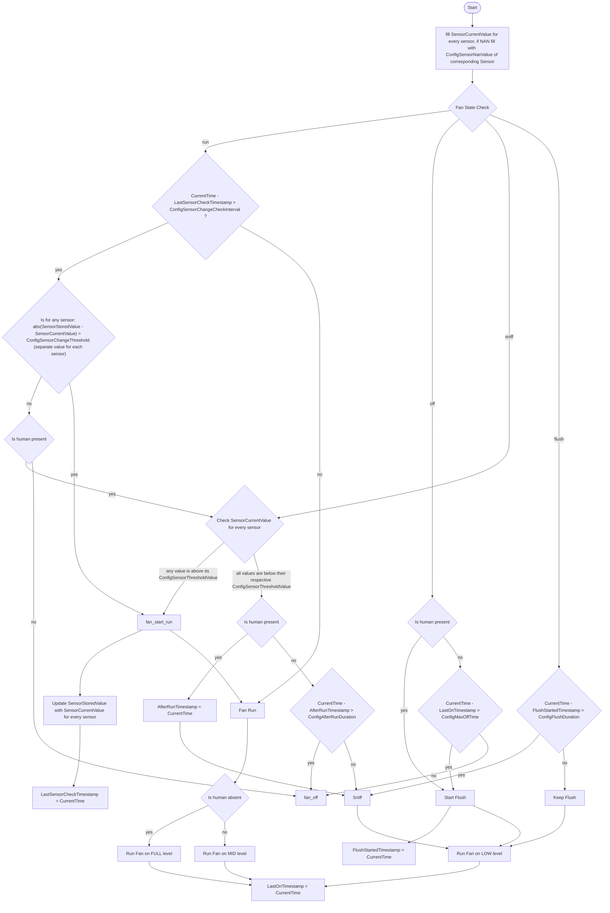

# Regelung — Zustandsmaschine

Autoritative Beschreibung der Lüfterregelung. Bei jeder Logikänderung müssen
dieses Diagramm, die Tabellen hier und die Implementierung in `bathvent.h` /
`bathvent.cpp` **zusammen** aktualisiert werden.

Kurzfassung: Der Lüfter kennt vier Zustände (`off`, `flush`, `sniff`, `run`) und
drei Stufen (LOW, MID, FULL). Es gibt **keine Baseline/EMA** — die Schwellen
sind absolut. Statt einer Pegel-Hysterese dämpft das **Prüfintervall**
(`change_check_interval`): ein Lauf endet erst, wenn sich in einem vollen
Intervall kein Sensorwert mehr signifikant bewegt hat. Messwerte sind nur nach
einer Kanal-Spülung vertrauenswürdig — bei stehendem Lüfter kann Außenluft
durch den Kanal zurückströmen und die Werte verfälschen.

## Diagramm


## Zustände und Stufen

| Zustand | Stufe | Bedeutung |
| :--- | :--- | :--- |
| `off` | OFF | Aus. Wartet auf Anwesenheit oder Ablauf von `max_off_time`. |
| `flush` | LOW | Kanal spülen (`flush_duration`), damit die Messwerte vertrauenswürdig sind. |
| `sniff` | LOW | Messfahrt: ein Wert über seiner Schwelle startet `run`, sonst Nachlauf oder Aus. |
| `run` | MID (anwesend) / FULL (abwesend) | Lüftung; läuft, solange sich ein Wert pro Intervall signifikant ändert. |

## Ablauf pro Tick (1 s)

1. **Messwerte lesen.** `NAN` (Sensor antwortet nicht) wird durch
   `humidity_nan_value` bzw. `voc_nan_value` ersetzt — das ist die
   Fail-safe-Policy (siehe unten).
2. **Zustand entscheiden** — pro Tick genau ein Zweig:

**`run`**
- `now - last_sensor_check_timestamp <= change_check_interval` → weiter MID/FULL.
- sonst: hat sich irgendein Wert um mehr als sein eigenes
  `*_change_threshold` bewegt?
  - ja → Referenzwerte aktualisieren, Intervall neu starten, weiter MID/FULL.
  - nein → anwesend? → **im selben Tick** die Sniff-Entscheidung auswerten
    (statt einfach auszuschalten); abwesend → `off`.

**`off`**
- anwesend → `flush` starten.
- sonst `now - last_on_timestamp > max_off_time` → `flush` starten
  (periodischer Luftaustausch), sonst aus bleiben.

**`sniff`**
- irgendein Wert über seiner Schwelle → `run` starten.
- sonst: anwesend → `after_run_timestamp = now`, weiter `sniff` (LOW);
  abwesend → `now - after_run_timestamp > afterrun_duration` ? → `off`
  : weiter `sniff` (LOW).

**`flush`**
- `now - flush_started_timestamp > flush_duration` → `sniff`, sonst weiter LOW.

Jede Stufe ungleich OFF setzt `last_on_timestamp = now`.

## Verhalten in typischen Situationen

| Situation | Verhalten |
| :--- | :--- |
| Anwesend, sauber | Dauerhaft LOW (`sniff`), ohne Takten |
| Anwesend, feucht | Dauerhaft MID, bis der Wert unter die Schwelle fällt |
| Abwesend, feucht | FULL, bis sich nichts mehr ändert; danach aus |
| Abwesend, sauber | Aus; alle `max_off_time` eine Flush-/Messfahrt |
| Licht aus nach sauberem Betrieb | `afterrun_duration` lang LOW, dann aus |
| Feuchtesensor tot | Wert liegt über der Schwelle → lüften (MID/FULL) |
| VOC-Sensor fehlt | Wert liegt unter der Schwelle → wird ignoriert |

## Konfiguration

Alle Parameter sind MQTT-`number`-Entitäten (`restore_value: true`). Die
kompilierten Defaults stehen in `BathventConfig` (`bathvent.h`); die
`initial_value` in `packages/bathvent_logic.yaml` müssen dazu passen.

| Parameter (YAML-Id) | Default | Bereich (Step) | Bedeutung |
| :--- | :--- | :--- | :--- |
| `humidity_threshold` | 65 % | 30–90 (1) | absolute Feuchte-Schwelle |
| `voc_threshold` | 150 | 101–400 (5) | VOC-Schwelle |
| `humidity_change_threshold` | 1 % | 0,1–5 (0,1) | Mindeständerung pro Intervall |
| `voc_change_threshold` | 10 | 1–50 (1) | Mindeständerung pro Intervall |
| `change_check_interval` | 300 s | 60–900 (30) | Prüfintervall **und** Mindestlaufzeit |
| `max_off_time` | 1800 s | 300–7200 (60) | Leerlauf bis zur periodischen Messfahrt |
| `flush_duration` | 30 s | 15–120 (5) | Kanal-Spülung vor einer Messung |
| `afterrun_duration` | 300 s | 60–600 (10) | LOW-Fenster nach Presence-Ende |
| `humidity_nan_value` | 101 | 0–200 (1) | Fail-safe-Wert Feuchte |
| `voc_nan_value` | 0 | 0–500 (1) | Fail-safe-Wert VOC |

`restore_value: true` heißt: Ein bereits gespeicherter Wert auf dem Gerät
**gewinnt** gegenüber einem geänderten Default nach dem Flashen. Neue Defaults
wirken dort erst nach einem Flash-Wipe oder nach einmaligem Setzen per MQTT.

## Fail-safe

Es gibt keine eigene Ausfall-Logik: Ein nicht antwortender Sensor liefert `NAN`,
und `NAN` wird durch den jeweiligen `*_nan_value` ersetzt. Die Ausfall-Policy ist
damit eine Konfigurationsentscheidung:

- **Feuchte über der Schwelle** (101 %) → ein toter Feuchtesensor gilt als
  "feucht", der Lüfter lüftet. Bewusst defensiv: lieber zu viel lüften.
- **VOC unter der Schwelle** (0) → ein fehlender SGP40 (optional) wird
  ignoriert und löst nichts aus.

Achtung: Ein konstanter Ersatzwert ändert sich nie, deshalb gilt ein Lauf mit
totem Sensor nach genau einem Prüfintervall als "stabil". Bei Anwesenheit fängt
der `run`-Zweig das ab (stabil + anwesend → erneut `sensor_check` → weiter MID);
bei Abwesenheit entsteht der gewollte periodische FULL-Puls.

## Trace und Logging

Der Tick ist eine wörtliche Übersetzung dieser Zustandsmaschine. Jede
**Entscheidung** wird mit ihren **Eingangsparametern** und ihrem **Ergebnis**
protokolliert, jede **Action** mit ihrer Wirkung — beides doppelt: ausführlich
im Log ("long text") und als Token im Trace-String ("short text").

- **Log (lang):** `decide <name> <parameter> -> YES|NO` bzw.
  `action <name> <wirkung>`, dazu eine Kopf- und eine Schlusszeile pro Tick. Auf
  dem Gerät über `ESP_LOGD("bathvent", ...)`; unter `-DBATHVENT_HOST_TEST` ist es
  ein No-op, mit zusätzlichem `-DBATHVENT_HOST_LOG` geht es auf stdout.
- **MQTT (kurz):** `trace` (Text-Sensor, max. 320 Zeichen). Der String wird am
  Anfang jedes Ticks geleert, Token für Token gefüllt und am **Ende des Ticks**
  publiziert — ein "Loop" ist also **ein 1-s-Tick**:

  ```
  <Zustand>|<entscheidung>(<parameter>)<yes|no>|…|<action>|…
  ```

Beispiel (Licht an, feucht — Spülung beendet, Messung entscheidet):

```
[bathvent] tick start: state=FLUSH light=1 hum=80.00(ok) voc=100.0(ok) now=33
[bathvent]   decide flush_time   flushing 31s vs 30s              -> YES
[bathvent]   action fan_sniff    flush finished
[bathvent]   action run_fan_on_low stage=LOW
[bathvent] tick end: state=SNIFF stage=LOW trace=FLUSH|flush_time(flushing 31s vs 30s)yes|fan_sniff|run_fan_on_low|reset_last_on_ts
```

Ein Tick kann mehrere Entscheidungen enthalten (im `run`-Zustand:
Intervall → Änderung → Anwesenheit → Messung), genau in der Reihenfolge des
Diagramms.

**Entscheidungen** (Token → Parameter → Knoten im Diagramm):

| Token | Parameter | Knoten |
| :--- | :--- | :--- |
| `presence` | `light=0\|1` | `flush_presence_check`, `sniff_presence_check`, `fan_off_presence_check` |
| `run_time` | `since check <n>s vs interval <n>s` | `running_time_check` |
| `change` | `dhum <v> vs <thr>, dvoc <v> vs <thr>` | `sensor_change_check` |
| `sensor` | `hum <v> vs <thr>, voc <v> vs <thr>` | `sensor_check` |
| `afterrun_done` | `afterrun <n>s vs <n>s` | `after_run_finished_check` |
| `flush_time` | `flushing <n>s vs <n>s` | `time_to_sniff_check` |
| `off_time` | `idle <n>s vs max_off <n>s` | `time_for_control_run_check` |
| `level` | `light=0\|1` (abwesend?) | `run_full_level_check` |

**Actions** (Token → Wirkung):

| Token | Wirkung |
| :--- | :--- |
| `start_flush`, `reset_flush_ts`, `run_fan_on_low` | Spülung starten (`start_flush`, `reset_flush_started_timestamp`, `run_fan_on_low`) |
| `keep_flush`, `run_fan_on_low` | Spülung fortsetzen |
| `start_run`, `update_stored`, `reset_check_ts` | `fan_start_run`, `update_stored_sensor_values`, `reset_last_sensor_check_timestamp` |
| `run_fan_on_low` / `run_fan_on_mid` / `run_fan_on_full` | Stufe setzen |
| `fan_sniff` | zurück in den Mess-Zustand (`sniff`) |
| `fan_off` | aus |
| `reset_afterrun_ts` | `AfterRunTimestamp = now` |
| `reset_last_on_ts` | `LastOnTimestamp = now` |

Der Puffer ist 320 Zeichen; der längste gemessene Trace (Pfad
`run → change → presence → sensor → start_run`) liegt bei ~250 Zeichen. Der
Host-Test prüft das und schlägt bei Truncation fehl.

## MQTT-sichtbarer Zustand

Alles, was der Controller zwischen Ticks speichert, wird publiziert:

| Entität | Typ | Inhalt |
| :--- | :--- | :--- |
| `Fan State` | text | `off` / `flush` / `sniff` / `run` |
| `Stage` | text | `OFF` / `LOW` / `MID` / `FULL` |
| `Trace` | text | kurzer Trace des Ticks |
| `Stored Humidity` / `Stored VOC Index` | sensor | Referenzwerte des Change-Checks |
| `Last Sensor Check Age` | sensor | Alter des Prüfintervall-Starts |
| `Last On Age` | sensor | Alter seit der letzten aktiven Stufe |
| `Afterrun Age` | sensor | Alter seit der letzten Anwesenheit im `sniff` |
| `Flush Age` | sensor | Alter seit dem Start der laufenden/letzten Spülung |

Die Rohsensoren (`Temperature`, `Humidity`, `VOC Index`) publizieren weiterhin
im eigenen 5-s-Takt; im Standstill können sie durch Rückströmung verfälscht sein.
Verlässlich sind nur Werte nach einer Spülung — der `Trace` zeigt, wann gemessen
wurde.

## Namens-Mapping (Diagramm → Code)

| Diagramm | YAML-Id | `BathventConfig` |
| :--- | :--- | :--- |
| `ConfigSensorThresholdValue` Feuchte | `humidity_threshold` | `humidity_threshold` |
| `ConfigSensorThresholdValue` VOC | `voc_threshold` | `voc_threshold` |
| `ConfigSensorChangeThreshold` | `humidity_change_threshold` / `voc_change_threshold` | dito |
| `ConfigSensorChangeCheckInterval` | `change_check_interval` | `change_check_interval_s` |
| `ConfigMaxOffTime` | `max_off_time` | `max_off_time_s` |
| `ConfigFlushDuration` | `flush_duration` | `flush_duration_s` |
| `ConfigAfterRunDuration` | `afterrun_duration` | `afterrun_duration_s` |
| `ConfigSensorNanValue` | `humidity_nan_value` / `voc_nan_value` | dito |
| `SensorStoredValue` | `Stored Humidity` / `Stored VOC Index` | `g_state.stored_*` |
| `SensorCurrentValue` | Rohsensoren | `BathventInputs` |
| `LastOnTimestamp` | `Last On Age` | `g_state.last_on_ts` |
| `AfterRunTimestamp` | `Afterrun Age` | `g_state.after_run_ts` |
| `FlushStartedTimestamp` | `Flush Age` | `g_state.flush_started_ts` |
| `LastSensorCheckTimestamp` | `Last Sensor Check Age` | `g_state.last_sensor_check_ts` |

## Tests

Die Logik ist hardwareunabhängig und läuft auf dem PC gegen synthetische
Messwerte und eine synthetische Uhr:

```
g++ -std=c++17 -Wall -Wextra -DBATHVENT_HOST_TEST -I. -o tests/bathvent_test tests/bathvent_test.cpp bathvent.cpp
./tests/bathvent_test
```

Abgedeckt: Dauerbetrieb LOW/MID ohne Takten, periodischer FULL-Puls bei
Abwesenheit, Nachlauf nach Licht aus, Fail-safe bei totem Feuchtesensor,
ignorierter VOC-Sensor, Zeitstempel-Überlauf, Trace-Format (Entscheidung mit
Eingangsparametern + Actions) und Trace-Länge. 


