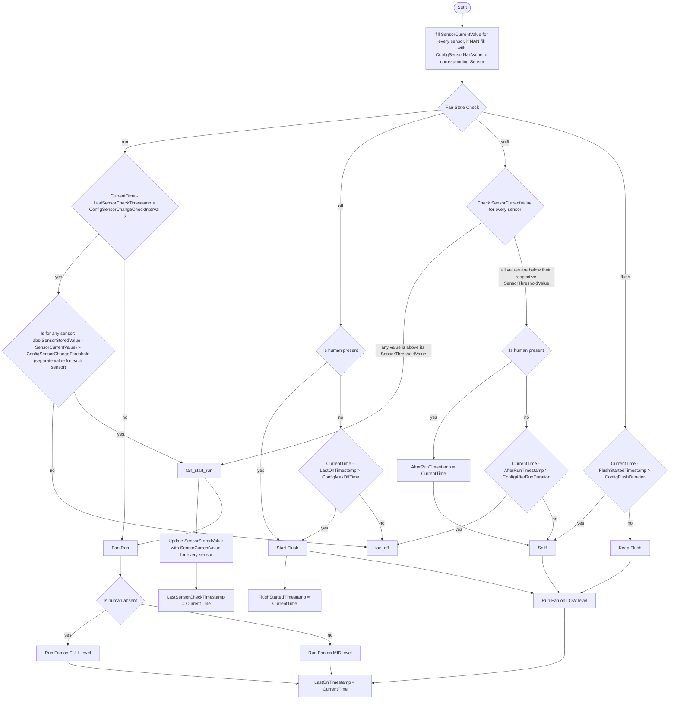

Additional information:

Every step and decision of a loop shall be logged into log as long text and additionally incrementally logged as short text into one string which at the end will be posted to the mqtt 

